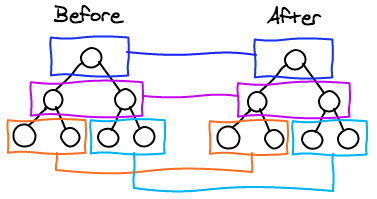

# 概念图



# diff方法

`function diff(dom, vnode, context, mountAll, parent, componentRoot)`接受五个参数

## connectedCallback生命周期

`diff()`第一个参数是真实DOM，第二个参数为`render()`执行后新的`JSX`对象
```js
// 在connectedCallback生命周期触发
this.L = diff(null, this.render(this.props, this.data, this.store), {}, !1, null, !1);
attachShadow.appendChild(this.L);

// 带的参数格式
dom = null, 
vnode = {attributes: {
    key: 1
    onClick: () => { console.log(1) }
}, children: ["Like"], key: 1, nodeName: "button"}, 
context = {}, 
mountAll = false, 
parent = null,
componentRoot = false
```
`connectedCallback`生命周期触发的`this.render()`就是组件类的`render()`方法
```js
this.render(this.props, this.data, this.store) // 返回jsx对象
// 组件
class LikeButton extends WeElement {
    render() {
        if (this.data.liked) {
            return 'You liked this.'
        }
        return {
            attributes: {
                key: 1,
                onClick: () => {
                    console.log({
                        ...this
                    })
                    this.data.liked = true
                    this.update()
                }
            },
            children: ["Like"],
            key: 1,
            nodeName: "button"
        }
    }
}
```
此时的`vnode`不是数组，是一个对象
```js
isArray(vnode) //false
```
所以进入`diff()`方法的另一个检测分支，而又由于`dom=null`所以继续进入`else`分支的`idiff()`方法里面执行
```js
if (isArray(dom)) ret = idiff(dom[0], vnode, context, mountAll, componentRoot);
else ret = idiff(dom, vnode, context, mountAll, componentRoot);
if (parent && ret.parentNode !== parent) parent.appendChild(ret);
```

# idiff方法

从上面的`else`分支进入到`idiff()`方法
```js
{
    dom = null, 
    vnode = {
        attributes: {
            key: 1,
            onClick: ()=>{}
        }, 
        children: ["like"], 
        key: 1, nodeName: "button"
    }, 
    context = {}, 
    mountAll = false, 
    componentRoot = undefined
}
```
```js
{
    dom = null, 
    vnode = "like", 
    context = {}, 
    mountAll = false, 
    componentRoot = undefined
}
```
如果`dom`为空则进入这个分支，这里会用到一个`createNode`方法
```js
 if (!dom || !isNamedNode(dom, vnodeName)) {
    //  out生成节点
    out = createNode(vnodeName, isSvgMode);
    if (dom) {
        while (dom.firstChild) out.appendChild(dom.firstChild);
        if (dom.parentNode) dom.parentNode.replaceChild(out, dom);
        recollectNodeTree(dom, !0);
    }
}
```
# createNode

判断是否`svg`格式，来决定生成怎么样的节点
```js
function createNode(nodeName, isSvg) {
    var node = isSvg ? document.createElementNS('http://www.w3.org/2000/svg', nodeName) : document.createElement(
        nodeName);
    // 另外添加_n属性值，赋值标签名字
    // 区别于tagName，__n是小写的
    node.__n = nodeName;
    return node;
}
```
如果`props`为空，则把`out.attributes`所有的属性值更新到`props`上面
```js
if (null == props) {
    props = out.__omiattr_ = {};
    for (var a = out.attributes, i = a.length; i--;) props[a[i].name] = a[i].value;
}
```

# innerDiffNode

这里是处理子节点，并且递归触发`idiff`方法
```js
{
    dom: button,
    vchildren: ["like"],
    context: {}, 
    mountAll: false, 
    isHydrating: false
}
```

# diff的流程

`render,diff和idiff`三个都接受两个相同的参数`dom`和`vnode`,除了第一次`dom`是为空之外，其余情况`dom`一般都会存在

不同于`react`的两份`vnode`对比的做法，`omi`和`preact`的做法都是把当前真实`dom`和新的`vnode`做对比，然后进行差异更新

- render 触发`idiff`
- diff `diff`会根据叠加器触发`idiff`然后重置`idiff`
- idiff 这里是`idiff`的核心，里面会判断每层的节点是否一样(`isNamedNode`方法)，然后如果不一样用`idiff`生成文本节点或者元素节点
- innerDiffNode `innerDiffNode`和`idiff`互相配合实现递归，生成子节点
- diffAttributes 往节点添加或者移除事件，并且绑定更新属性值

# 参考文档

- [从Preact了解一个类React的框架是怎么实现的(二): 元素diff](https://segmentfault.com/a/1190000011333383)
- [帮你读懂preact的源码（一）](https://segmentfault.com/a/1190000014945397)